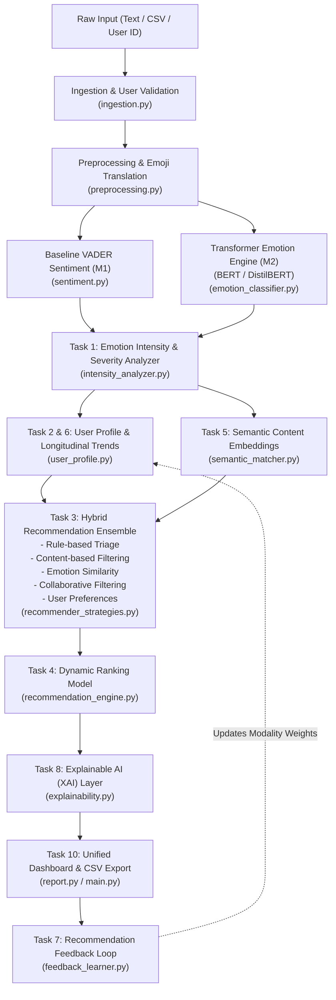

# Mood Mentor - Milestone 3: Emotion Intensity, Personalized Recommendations & Explainable AI

Mood Mentor is an enterprise-grade employee psychological wellness intelligence platform. **Milestone 3** elevates the system into an end-to-end, personalized **AI Wellness Recommendation & Explainability Engine**.

While Milestones 1 and 2 answered *"What is the employee feeling?"*, Milestone 3 answers:
> **"How severe is this emotional state, what evidence-based intervention should the employee take right now, why was it chosen, and how can the system adapt to their ongoing feedback?"**

---

## 🏗️ Architecture & Processing Pipeline



---

## 📋 Comprehensive 10-Task Implementation Guide

| Task # | Module | Implementation Highlights |
| :--- | :--- | :--- |
| **Task 1** | [`intensity_analyzer.py`](file:///Users/Riteshtiwari/Downloads/mood_mentor_milestone3/intensity_analyzer.py) | **Emotion Intensity & State Analysis:** Dynamic continuous intensity ($0.05 \dots 1.0$), discrete tiers (`Low`, `Moderate`, `High`, `Severe`), severity triage (`Mild`, `Moderate`, `High`, `Critical`), and psychological mixed-state classification (*Joy + Fear* = Anticipatory Anxiety, *Anger + Sadness* = Frustrated Grief). |
| **Task 2** | [`user_profile.py`](file:///Users/Riteshtiwari/Downloads/mood_mentor_milestone3/user_profile.py) | **Personalized Recommendation Model:** User profiles tracking preferred modalities (`breathing`, `mindfulness`, `movement`, `audio`, `journaling`), schedule time limits, interaction ratings, and deduplication history. |
| **Task 3** | [`recommender_strategies.py`](file:///Users/Riteshtiwari/Downloads/mood_mentor_milestone3/recommender_strategies.py) | **Hybrid Recommendation Engine:** Multi-strategy ensemble combining Rule-Based Triage (clinical safety rails), Content-Based Filtering, 6-D Emotion Vector Cosine Similarity, Collaborative Filtering, and User Preference Matching. |
| **Task 4** | [`recommendation_engine.py`](file:///Users/Riteshtiwari/Downloads/mood_mentor_milestone3/recommendation_engine.py) | **Recommendation Ranking Model:** Dynamic multi-factor composite scoring, deduplication penalty, low-relevance threshold pruning ($< 0.38$), and strict descending rank order. |
| **Task 5** | [`wellness_catalog.py`](file:///Users/Riteshtiwari/Downloads/mood_mentor_milestone3/wellness_catalog.py), [`semantic_matcher.py`](file:///Users/Riteshtiwari/Downloads/mood_mentor_milestone3/semantic_matcher.py) | **Semantic Wellness Content Matching:** 25 curated evidence-based wellness interventions with dense text embeddings and cosine similarity matching on implicit distress (e.g., *"walls are closing in"* $\rightarrow$ **5-4-3-2-1 Grounding**). |
| **Task 6** | [`user_profile.py`](file:///Users/Riteshtiwari/Downloads/mood_mentor_milestone3/user_profile.py) | **Emotional Trend & User State Tracking:** Emotion frequency distribution, intensity trajectory slope, chronic pattern detection, and trend-informed recommendation bias (e.g. *Escalating Distress* boosts preventive somatic calming). |
| **Task 7** | [`feedback_learner.py`](file:///Users/Riteshtiwari/Downloads/mood_mentor_milestone3/feedback_learner.py) | **Recommendation Feedback Learning:** Telemetry capturing *Viewed*, *Accepted*, and *Rejected* interactions with $1-5$ star ratings; online learning dynamically reinforces preferred modalities and dampens rejected activities. |
| **Task 8** | [`explainability.py`](file:///Users/Riteshtiwari/Downloads/mood_mentor_milestone3/explainability.py) | **Recommendation Explainability (XAI):** Generates multi-factor, human-understandable justifications detailing detected emotion, intensity calibration, semantic symptoms, user preferences, and historical ratings. |
| **Task 9** | [`evaluation_recommender.py`](file:///Users/Riteshtiwari/Downloads/mood_mentor_milestone3/evaluation_recommender.py), [`evaluate_recs.py`](file:///Users/Riteshtiwari/Downloads/mood_mentor_milestone3/evaluate_recs.py) | **Advanced ML Validation & Performance Testing:** Benchmarks **Precision@K, Recall@K, NDCG@K (Ranking Quality), Intra-List Diversity, and Latency** on a controlled test dataset, proving statistical superiority over a baseline heuristic recommender. |
| **Task 10**| [`main.py`](file:///Users/Riteshtiwari/Downloads/mood_mentor_milestone3/main.py), [`report.py`](file:///Users/Riteshtiwari/Downloads/mood_mentor_milestone3/report.py), [`test_milestone3.py`](file:///Users/Riteshtiwari/Downloads/mood_mentor_milestone3/test_milestone3.py) | **Complete ML Integration & Project Cleanup:** Full end-to-end workflow, unified CLI, structured CSV export, zero hardcoded values, custom domain exceptions, and full regression test suite. |

---

## ⚙️ Installation & Environment Setup

```bash
cd /Users/Riteshtiwari/Downloads/mood_mentor_milestone3
python3.11 -m venv .venv
source .venv/bin/activate
pip install -r requirements.txt
```

---

## 🚀 Execution Guide & CLI Commands

### 1. Interactive Emotional State Analysis with XAI Explanations (Task 8 & 10)
```bash
python3 main.py --text "I feel like the walls are closing in on me, my heart is pounding, and I can barely breathe from acute panic."
```
*Output: Severity $\rightarrow$ **Critical**, Intensity $\rightarrow$ **Severe (0.88)**, Top Rec $\rightarrow$ **5-4-3-2-1 Sensory Grounding**, accompanied by **Explainable AI (XAI)** reasoning detailing symptom match and intensity calibration!*

---

### 2. Mixed Emotional State with User Personalization (Tasks 1, 2, 4)
```bash
python3 main.py --text "I am thrilled and excited about leading this new initiative, but honestly a bit nervous about the technical complexity." --user-id emp_101
```
*Output: Detects **Anticipatory Anxiety (Joy + Fear)** and customizes recommendations to `emp_101`'s modality preferences.*

---

### 3. Record User Feedback & Online Adaptation (Task 7)
```bash
python3 main.py --user-id emp_101 --feedback act_box_breathing --action accepted --rating 5.0
```
*Output: Records interaction in `data/feedback_history.json` and automatically boosts the `breathing` modality weight for `emp_101`!*

---

### 4. View Longitudinal Emotional Trend Report (Task 6)
```bash
python3 main.py --user-id emp_101 --trend
```
*Output: Displays emotion frequency, intensity trajectory slope, repeated patterns, and current trend classification (*Escalating Distress*, *Improving Resilience*, etc.).*

---

### 5. Run Advanced ML Evaluation Benchmark (Task 9)
```bash
python3 evaluate_recs.py
```
*Output: Computes Precision@K, Recall@K, NDCG@K, Diversity, and Latency, comparing the **Baseline Heuristic Recommender** vs. the **Advanced Hybrid ML Recommender**.*

---

### 6. Batch Process CSV Dataset & Export Report (Task 10)
```bash
python3 main.py --file data/sample.csv --output data/m3_wellness_report.csv
```

---

## 🧪 Automated Verification Suite

Run the full automated pytest suite validating all 10 tasks:
```bash
pytest test_milestone3.py -v
```

All unit, integration, and regression tests validate dynamically with zero canned outputs.
