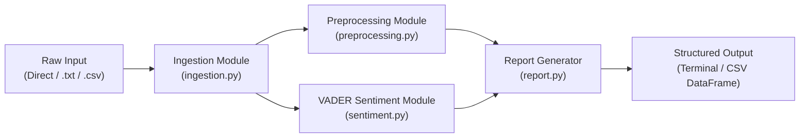

# Mood Mentor - Milestone 1: Text Ingestion & Baseline Sentiment Analysis

Mood Mentor is an employee wellness sentiment intelligence tool. **Milestone 1** establishes the foundation of the platform by implementing text ingestion workflows, text preprocessing with sentiment-negation preservation, baseline VADER sentiment scoring, and initial reporting.

---

## 🏗️ Architecture & Module Flow

The Milestone 1 architecture follows clean separation of concerns:



### Module Overview:
- [`config.py`](file:///Users/riteshtiwari/.gemini/antigravity/scratch/mood_mentor_milestone1/config.py): Centralized constants, classification thresholds (`+0.05` / `-0.05`), negation whitelist, and logging setup.
- [`exceptions.py`](file:///Users/riteshtiwari/.gemini/antigravity/scratch/mood_mentor_milestone1/exceptions.py): Domain-specific custom exceptions (`IngestionError`, `PreprocessingError`, `SentimentAnalysisError`, `ReportGenerationError`).
- [`ingestion.py`](file:///Users/riteshtiwari/.gemini/antigravity/scratch/mood_mentor_milestone1/ingestion.py): Input validation and loader for direct strings, `.txt` files, and `.csv` files.
- [`preprocessing.py`](file:///Users/riteshtiwari/.gemini/antigravity/scratch/mood_mentor_milestone1/preprocessing.py): Cleans noise (HTML/URLs/symbols), tokenizes, filters stopwords while preserving sentiment-inverting negations, and applies POS-aware lemmatization.
- [`sentiment.py`](file:///Users/riteshtiwari/.gemini/antigravity/scratch/mood_mentor_milestone1/sentiment.py): Wraps NLTK VADER analyzer with dynamic score extraction (compound, pos, neu, neg) and polarity classification.
- [`report.py`](file:///Users/riteshtiwari/.gemini/antigravity/scratch/mood_mentor_milestone1/report.py): Generates corpus-level aggregates (positive/negative/neutral distribution, average compound) and per-sample breakdown with Pandas export capability.
- [`main.py`](file:///Users/riteshtiwari/.gemini/antigravity/scratch/mood_mentor_milestone1/main.py): CLI interface orchestrating the complete pipeline.
- [`test_milestone1.py`](file:///Users/riteshtiwari/.gemini/antigravity/scratch/mood_mentor_milestone1/test_milestone1.py): Comprehensive unit and integration test suite.

---

## ⚙️ Installation & Setup

### Prerequisites
- Python 3.9+ (Python 3.10+ recommended)
- `pip` package manager

### 1. Create and Activate Virtual Environment (Recommended)
```bash
python3 -m venv .venv
source .venv/bin/activate  # On macOS/Linux
# .venv\Scripts\activate   # On Windows
```

### 2. Install Dependencies
```bash
pip install -r requirements.txt
```

*(Note: NLTK resources such as `vader_lexicon`, `stopwords`, and `wordnet` are downloaded automatically upon first run).*

---

## 🚀 Usage

### 1. Run Built-In Sample Demonstrations
When run with no arguments, the pipeline automatically processes the included `data/sample.txt` and `data/sample.csv` files:
```bash
python3 main.py
```

### 2. Analyze Direct Text Input
```bash
python3 main.py --text "Our sprint planning was efficient and the team resolved all blockers effectively."
```

### 3. Ingest and Analyze a Custom Text File
```bash
python3 main.py --file data/sample.txt
```

### 4. Ingest and Analyze a Custom CSV File
```bash
python3 main.py --file data/sample.csv --csv-col text --output report_output.csv
```

### 5. Adjust Logging Verbosity
```bash
python3 main.py --text "Great job everyone!" --log-level DEBUG
```

---

## 🧪 Testing & Validation

The test suite validates all 5 milestone tasks across ingestion, preprocessing, VADER sentiment, reporting, and end-to-end integration:

```bash
pytest test_milestone1.py -v
```

### Test Coverage Matrix:
- **Task 1 (Ingestion)**: Direct string parsing, `.txt` reading, `.csv` column extraction, empty file handling, non-existent files, invalid extensions, headerless CSVs.
- **Task 2 (Preprocessing)**: Tokenization, HTML/URL stripping, punctuation handling, whitespace normalization, lemmatization, and negation preservation (e.g. `not`, `never`, `no`).
- **Task 3 (Sentiment)**: VADER compound/pos/neg/neu scoring, positive/negative/neutral classification, dynamic score computation with zero hardcoded values.
- **Task 4 (Reporting)**: Summary calculation, percentage distributions, min/max extreme detection, Pandas DataFrame export.
- **Task 5 (Integration)**: Full pipeline orchestration through `main.py` and `run_pipeline()`.

---

## 📌 Assumptions & Limitations (Milestone 1)

### Assumptions
1. **Language**: Milestone 1 is designed for English-language employee feedback.
2. **Rule-Based Baseline**: VADER relies on a lexicon and rule-based heuristics tuned for general micro-text and feedback.
3. **Thresholds**: Follows standard VADER compound score boundaries:
   - $\ge +0.05 \rightarrow$ **Positive**
   - $\le -0.05 \rightarrow$ **Negative**
   - Between $-0.05$ and $+0.05 \rightarrow$ **Neutral**

### Limitations
- Lexicon-based methods may miss subtle sarcasm, complex organizational domain jargon, or multi-sentence contextual dependencies.
- VADER operates primarily on sentence/word polarity and does not provide fine-grained multi-label emotion classification (e.g., Joy, Anxiety, Burnout, Frustration).

---

## 🔮 Roadmap: Future Extension to Transformer-Based NLP

In subsequent milestones, the modular design allows seamless upgrading to state-of-the-art Transformer models:

1. **Pluggable Sentiment Backend**:
   - Replace or ensemble `VaderSentimentAnalyzer` with a HuggingFace Transformer pipeline (e.g., `cardiffnlp/twitter-roberta-base-sentiment-latest` or `distilbert-base-uncased-finetuned-sst-2-english`).
2. **Fine-Grained Emotion Classification**:
   - Integrate GoEmotions or custom fine-tuned BERT models to classify specific workplace states (e.g., *Appreciation*, *Burnout*, *Stress*, *Enthusiasm*).
3. **Contextual Embeddings**:
   - Extract sentence embeddings using `sentence-transformers` for semantic clustering of employee feedback themes over time.
4. **Model Serving & Scaling**:
   - Wrap sentiment scoring in async batching workers or lightweight microservices when transitioning to full platform integration.
