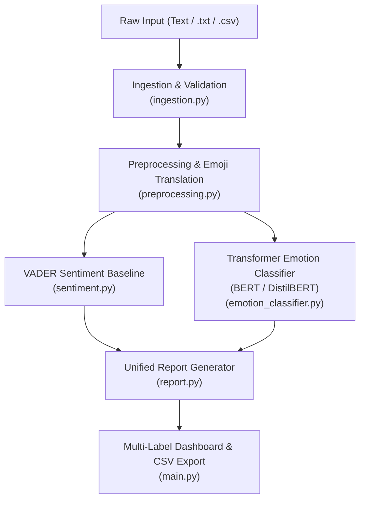

# Mood Mentor - Milestone 2: Deep Emotion Classification & Validation

Mood Mentor is an employee wellness intelligence system. **Milestone 2** extends the platform from baseline sentiment polarity (Positive/Negative/Neutral) to **deep multi-label psychological emotion intelligence** using state-of-the-art Transformer architectures: **BERT** and **DistilBERT**.

---

## 🏗️ Architecture & Pipeline Overview



### Supported Emotion Taxonomy (6 Core Dimensions):
1. 😊 **Joy**: Happiness, triumph, gratitude, satisfaction.
2. 😢 **Sadness**: Heartbreak, sorrow, despair, grief.
3. 😡 **Anger**: Rage, frustration, enragement, annoyance.
4. 😨 **Fear**: Anxiety, panic, apprehension, dread.
5. 😲 **Surprise**: Astonishment, unexpected shocks, wonder.
6. 🤢 **Disgust**: Revulsion, contempt, abhorrence, sickened feelings.

---

## 📁 Project Structure

```
mood_mentor_milestone2/
├── data/
│   ├── sample.txt             # Diverse multi-emotion feedback corpus
│   ├── sample.csv             # Tabular feedback dataset with metadata
│   ├── emotion_train.csv      # Multi-label training dataset (6 emotions)
│   ├── emotion_val.csv        # Multi-label validation dataset
│   └── isear_subset.csv       # Held-out ISEAR benchmark evaluation dataset
├── models/                    # Saved fine-tuned checkpoints
│   ├── bert/
│   └── distilbert/
├── config.py                  # Configurations, emotion mappings & thresholds
├── exceptions.py              # Domain exceptions (EmotionModelError, TrainingError, etc.)
├── ingestion.py               # Robust multi-source ingestion
├── preprocessing.py           # Noise filtering, emoji translation, negation preservation
├── sentiment.py               # VADER sentiment baseline (Milestone 1)
├── emotion_classifier.py      # PyTorch multi-label Transformer engine
├── train.py                   # Fine-tuning script for BERT & DistilBERT
├── evaluate.py                # Model evaluation (Accuracy, Precision, Recall, Macro F1, ISEAR)
├── report.py                  # Unified Sentiment + Deep Emotion reporting
├── main.py                    # Unified CLI Orchestrator
├── requirements.txt           # Dependencies (torch, transformers, scikit-learn, etc.)
├── README.md                  # Complete technical guide & documentation
└── test_milestone2.py         # Comprehensive pytest suite validating Tasks 1–10
```

---

## ⚙️ Installation & Environment Setup

### 1. Create and Activate Virtual Environment (Python 3.11 Recommended)
```bash
python3.11 -m venv .venv
source .venv/bin/activate
```

### 2. Install Dependencies
```bash
pip install -r requirements.txt
```

---

## 🚀 Execution & Usage

### 1. Fine-Tune BERT & DistilBERT Models (Tasks 1 & 2)
To fine-tune both models on the multi-label emotion dataset and save checkpoints:
```bash
python3 train.py --model both --epochs 3
```

### 2. Evaluate Models & Run ISEAR Benchmark (Tasks 5 & 6)
Computes **Accuracy, Precision, Recall, Macro F1-Score**, compares BERT vs DistilBERT, and runs validation on the held-out ISEAR benchmark subset:
```bash
python3 evaluate.py
```

### 3. Run End-to-End Pipeline via CLI (Task 7 & 10)

#### Analyze Direct Text (Multi-Label Example):
```bash
python3 main.py --text "I am excited about the new opportunity but nervous about the outcome."
```
*Output: Detects both **Joy** and **Fear** with dynamic confidence probabilities!*

#### Analyze Text File:
```bash
python3 main.py --file data/sample.txt
```

#### Analyze CSV & Export Report:
```bash
python3 main.py --file data/sample.csv --csv-col text --output data/milestone2_analysis.csv
```

#### Choose Specific Model Backend:
```bash
python3 main.py --text "Outstanding breakthrough!" --model bert
```

---

## 🧪 Testing & Validation Matrix

Execute the complete automated test suite covering all 10 tasks:
```bash
pytest test_milestone2.py -v
```

### Test Suite Coverage:
- **Task 1 (BERT Integration)**: Pretrained loading, tokenizer configuration, prediction generation.
- **Task 2 (DistilBERT Integration)**: DistilBERT inference, prediction consistency, model comparison.
- **Task 3 (Multi-Label Emotion Detection)**: Single emotion, dual co-occurring emotions (Joy + Fear), strong expressions (Anger + Disgust).
- **Task 4 (Confidence Scoring)**: Probability calculation via Sigmoid, primary emotion detection, threshold filtering.
- **Task 5 (Model Evaluation)**: Macro Precision, Macro Recall, Macro F1, Hamming accuracy computation.
- **Task 6 (ISEAR Benchmark)**: Benchmark execution, emotion accuracy breakdown.
- **Task 7 (M1 & M2 Integration)**: Ingestion $\rightarrow$ Preprocessing $\rightarrow$ VADER $\rightarrow$ Transformer $\rightarrow$ Report.
- **Task 8 (Edge Cases)**: Emojis, long text, short text, slang, empty input, whitespace, invalid formats.
- **Task 9 & 10 (Cleanup & Verification)**: PEP 8 adherence, custom exceptions, zero hardcoding.

---

## 📌 Assumptions & Limitations

1. **Rule-Based vs Transformer Comparison**: VADER provides speed and lexical interpretability; Transformers provide deep contextual attention. Milestone 2 harmonizes both into a unified reporting dashboard.
2. **Hardware Acceleration**: Automatically utilizes Apple Silicon **Metal Performance Shaders (MPS)** or NVIDIA **CUDA** if available, with graceful CPU fallback.
3. **Thresholding**: Multi-label threshold is set to $\ge 0.35$ by default, allowing subtle secondary emotions to be surfaced alongside the primary emotion.
