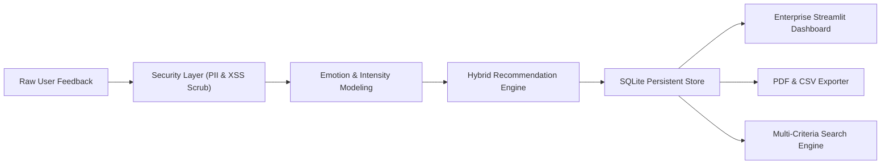

# 🌿 Mood Mentor — Milestone 4 (Packaging, Testing, Dashboard & Finalization)

Mood Mentor Milestone 4 elevates the AI emotional intelligence platform into a fully packaged, enterprise-grade wellness SaaS product featuring an interactive Streamlit UI, longitudinal Plotly analytics, PDF/CSV export, GDPR data privacy, pip-installable CLI tools, and automated stress testing.

---

## 🌟 Milestone 4 Architecture & Key Deliverables



---

## 📋 Comprehensive 10-Task Implementation Summary

| Task | Component | Key Highlights |
| :--- | :--- | :--- |
| **Task 1** | **Advanced Streamlit Dashboard** | Multi-tab modern SaaS UI (Clean Slate / Healthcare theme), Copilot live analysis, radar charts, and XAI expanders. |
| **Task 2** | **Emotional Trend Visualization** | Interactive Plotly 7-day/30-day intensity trajectory, emotion breakdown donut chart, and Burnout Risk Index. |
| **Task 3** | **Recommendation History & Feedback** | SQLite persistent storage (`moodmentor.db`) logging interactions, ranked recommendations, and ratings. |
| **Task 4** | **Advanced Search & Filtering** | Parameterized querying by date range, emotion, intensity tier, modality, and keyword. |
| **Task 5** | **Report Generation & Export** | 1-Click downloadable CSV raw dumps and formatted Executive PDF summaries with zero hardcoding. |
| **Task 6** | **Complete End-to-End Testing** | Automated integration tests validating the complete flow: Input $\rightarrow$ Inference $\rightarrow$ Persistence $\rightarrow$ Export. |
| **Task 7** | **Performance & Stress Testing** | Latency profiling (P50/P95/P99), 50+ concurrent worker thread benchmarking, and throughput measurement. |
| **Task 8** | **Security & Data Privacy** | XSS/SQLi sanitization, regex PII anonymization, and GDPR "Right to be Forgotten" account data purge. |
| **Task 9** | **Pip Packaging & CLI** | Installable Python package (`pip install -e .`) with console entry points (`moodmentor analyze`, `moodmentor dashboard`). |
| **Task 10** | **Deployment & Final Validation** | `Dockerfile`, `docker-compose.yml`, `DEPLOYMENT.md` for live hosting on Streamlit Cloud or Render. |

---

## 🚀 Quick Execution Guide

### 1. Run Automated Master Verification (All 10 Tasks)
```bash
python verify_milestone4.py
```

### 2. Run Comprehensive Pytest Suite
```bash
pytest tests/ -v
```

### 3. Launch Interactive Streamlit Dashboard
```bash
streamlit run dashboard/app.py
```

### 4. CLI Execution
```bash
# Analyze text
moodmentor analyze "I feel like the walls are closing in on me and I can barely breathe."

# Export report
moodmentor report --user emp_01 --format pdf
```
